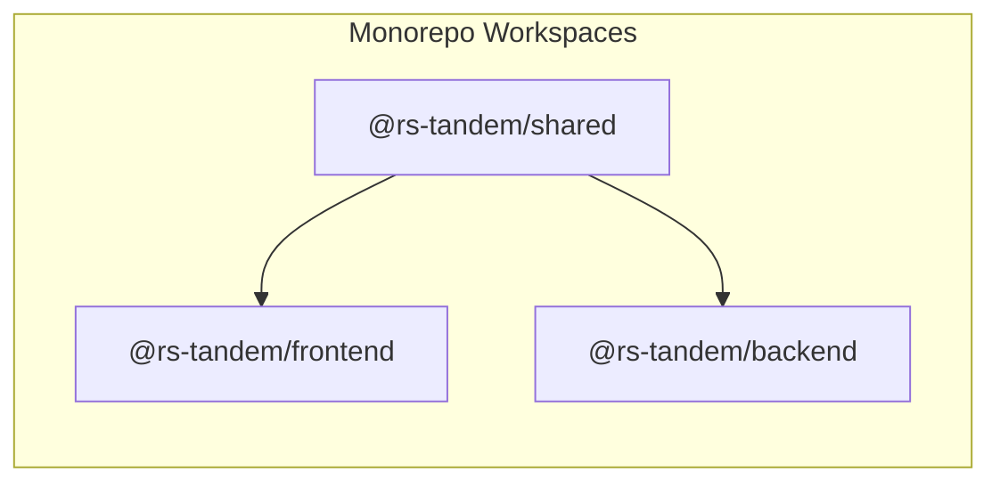

# RS-Tandem

## 🚀 About the Project

**RS-Tandem** is a gamified platform for technical interview prep, offering interactive JS, TS, and algorithm quizzes alongside a dedicated AI chat for technical assistance. It features a personalized experience with user profiles and customizable avatars, transforming study into a dynamic environment with instant feedback.

## 🔗 Deployment

🌐 **Live Application:**
https://jsgods-rs-tandem.github.io/rs-tandem/

🚀 **Backend API (Railway):**
https://rs-tandem-production.up.railway.app/api/health

---

## 👥 Team & Development Diaries

| Name              | Github                                                  | Development Diary                                                                                                  |
| :---------------- | :------------------------------------------------------ | :----------------------------------------------------------------------------------------------------------------- |
| Diana Dukhovskaya | [dukhd](https://github.com/dukhd)                       | [🔗 DEVELOPMENT_DIARY](https://github.com/jsgods-rs-tandem/rs-tandem/tree/main/development-notes/dukhd)            |
| Boris Zashliapin  | [elrouss](https://github.com/elrouss)                   | [🔗 DEVELOPMENT_DIARY](https://github.com/jsgods-rs-tandem/rs-tandem/tree/main/development-notes/elrouss)          |
| Daniil Mikhalenka | [mikhalenkadaniil](https://github.com/mikhalenkadaniil) | [🔗 DEVELOPMENT_DIARY](https://github.com/jsgods-rs-tandem/rs-tandem/tree/main/development-notes/mikhalenkadaniil) |
| Mikita Kern       | [nck1969](https://github.com/nck1969)                   | [🔗 DEVELOPMENT_DIARY](https://github.com/jsgods-rs-tandem/rs-tandem/tree/main/development-notes/nck1969)          |
| Ales Drobysh      | [alesdrobysh](https://github.com/alesdrobysh)           | N/A - mentor                                                                                                       |

### 📝 Meeting Notes

- [🔗 Meeting Notes - Meeting #3 (Feb 15, Sunday)](https://github.com/jsgods-rs-tandem/rs-tandem/issues/2#issue-3937972932)
- [🔗 Meeting Notes - Meeting #4 (Feb 18, Wednesday)](https://github.com/jsgods-rs-tandem/rs-tandem/issues/4#issue-3944841485)
- [🔗 Meeting Notes - Meeting #5 (March 23, Monday)](https://github.com/jsgods-rs-tandem/rs-tandem/issues/9#issue-3959693160)

---

## ⚙️ Development Processes

### Project Management

**Board Link:** [rs-tandem kanban board](https://github.com/orgs/jsgods-rs-tandem/projects/2) \
We used **GitHub Projects** with a **Kanban board** to manage tasks and track our progress throughout the development cycle.


### Top Pull Requests

1. [🔗 PR #6: chore: setup project environment](https://github.com/jsgods-rs-tandem/rs-tandem/pull/6) — Project Foundation: Set up the core project structure for both frontend and backend. Initialized the monorepo architecture using npm workspaces for Angular and NestJS, strict linting (ESLint/Prettier), and automated Husky hooks for pre-commit checks and branch protection.
2. [🔗 PR #118: feat: implement user store](https://github.com/jsgods-rs-tandem/rs-tandem/pull/118) — User Data Management: Created a central "source of truth" for user and login info. This makes user data instantly available to every part of the app without needing extra server requests or messy code.
3. [🔗 PR #95: feat: implement quiz page](https://github.com/jsgods-rs-tandem/rs-tandem/pull/95) — Interactive Quiz Engine: Built a complete quiz page with a timer, code highlighting, and instant feedback. Created a library of reusable UI parts so that adding new types of quizzes in the future is fast and easy.
4. [🔗 PR #202: feat: implement settings for ai chat](https://github.com/jsgods-rs-tandem/rs-tandem/pull/202) — Developed a dedicated settings page for the AI chat, enabling users to choose remote providers and manage their history.

---

## 📦 Monorepo Structure & Dependencie

The project follows a **Monorepo** pattern using **npm workspaces**. This ensures a clear separation of concerns and efficient code sharing between the client and server.



---

## 📺 Demo Video

[🔗 Demo Video - TBC](link) \
[🔗 Demo Video - Checkpoint 5](https://youtu.be/pV0YgJyy_Nk)

---

## 🛠 Local Setup & Installation

Follow these steps to set up the project locally.

### 1\. Prerequisites (Strict Environment)

Before proceeding, verify that your local environment matches the project's engine specifications. Running on older versions may result in unhandled exceptions or build failures.

- **Node.js:** `^24.13.1` (Verify: `node -v`)
- **NPM:** `^11.10.1` (Verify: `npm -v`)
- **Docker Desktop:** Required for PostgreSQL orchestration.
- **Ollama:** Required for local LLM inference.

### 2\. Repository Initialization

Clone the repository and install dependencies for all workspaces from the project root:

```bash
git clone https://github.com/jsgods-rs-tandem/rs-tandem.git
cd rs-tandem
npm install
```

---

### 3\. Backend Infrastructure Setup

_All backend commands should be executed from the root using the `-w @rs-tandem/backend` flag or from the `packages/backend` directory._

#### A. Database Orchestration

Spin up the PostgreSQL container (ensure port `5432` is not occupied):

```bash
docker compose up -d
```

#### B. Environment Configuration

Initialize the environment file and generate a cryptographically secure 32-byte string for `JWT_SECRET`:

```bash
cp packages/backend/.env.example packages/backend/.env
# Generate a secret
openssl rand -hex 32
```

Manually paste the generated string into the `JWT_SECRET` field in your `.env` file.

#### C. Database Schema & Seeding

Apply SQL migrations to initialize the schema and populate the database with quiz content (categories, topics, and questions):

```bash
# Apply migrations (schema source of truth)
npm run migrate:up -w @rs-tandem/backend

# Seed initial content
npm run seed:content -w @rs-tandem/backend
```

---

### 4\. AI Engine (Ollama) Setup

To enable AI-powered features, ensure the Ollama service is configured:

1.  **Download:** [ollama.com](https://ollama.com/)
2.  **Pull Model:**
    ```bash
    ollama pull gemma3:1b
    ```
3.  **Start Service:** `ollama serve`. By default, the backend expects the API at `http://localhost:11434`.

---

### 5\. Running the Project

**[!IMPORTANT]**

**Process Management:** To run the full stack, you will need two separate terminal sessions:

- One for the **AI Engine** (`ollama serve`).
- One for the **Application Suite** (`npm start`), which executes both Frontend and Backend concurrently in a single window.

| Target         | Command                  | Access URL                  |
| :------------- | :----------------------- | :-------------------------- |
| **Full Stack** | `npm start`              | (Both Apps)                 |
| **Frontend**   | `npm run start:frontend` | `http://localhost:4200`     |
| **Backend**    | `npm run start:backend`  | `http://localhost:3000/api` |

---

### 🛠 Developer Tooling & DX

| Command                    | Scope | Description                                          |
| :------------------------- | :---- | :--------------------------------------------------- |
| `npm run typecheck`        | Root  | Runs TypeScript type checking across all packages    |
| `npm run lint`             | Root  | Runs ESLint for all packages                         |
| `npm run format`           | Root  | Prettier code formatting                             |
| `npm test`                 | Root  | Execute all unit & integration tests                 |
| `npm run test:frontend:ui` | Root  | Runs frontend tests with Vitest UI and code coverage |

---

### 📡 API & Health Verification

Confirm the backend status via the health-check endpoint:

- **Health Check:** `GET http://localhost:3000/api/health`
- **Detailed Documentation:** See [API.md](https://github.com/jsgods-rs-tandem/rs-tandem/blob/main/packages/backend/API.md) for full endpoint specifications, including Authentication, Profiles, and Quiz logic.

---

## 💻 Tech Stack

### Frontend

- **Framework:** Angular 21
- **Language:** TypeScript
- **Styling:** SCSS
- **Build System:** Angular CLI (Esbuild & Vite / Application Builder)
- **Internationalization:** Transloco (i18n)
- **AI Integration:** Ollama (LLM integration), Streaming-Markdown, DOMPurify
- **Code Highlighting:** PrismJS
- **Real-time:** Socket.io-client (Websockets)

### Backend

- **Framework:** NestJS
- **Language:** TypeScript
- **API:** REST API (HTTP)
- **Real-time:** Socket.io (Websockets)
- **Database:** PostgreSQL
- **Migrations:** node-pg-migrate
- **Security:** JWT (Passport.js), Bcryptjs

### Architecture & Tooling

- **Monorepo:** NPM Workspaces
- **Infrastructure:** Docker & Docker Compose (used for E2E and environment consistency)
- **Deployment:** GitHub Pages (frontend) & Railway (backend)
- **CI/CD:** GitHub Actions

### Code Quality & DX

- **Testing:**
  - Frontend: Vitest & Vitest UI (unit/component testing)
  - Backend: Jest & Supertest
  - E2E: Playwright (integrated with Docker)
- **Linting & Formatting:**
  - ESLint (Unicorn, Import, Unused-imports plugins)
  - Stylelint (SCSS standard, Clean-order)
  - Prettier
- **Git Hooks:**
  - Husky (pre-commit, pre-push)
  - Lint-staged
  - Commitlint (Conventional Commits)
  - Validate-branch-name (strict branch naming policy)

---

## 📄 License

This project is licensed under the MIT License.
