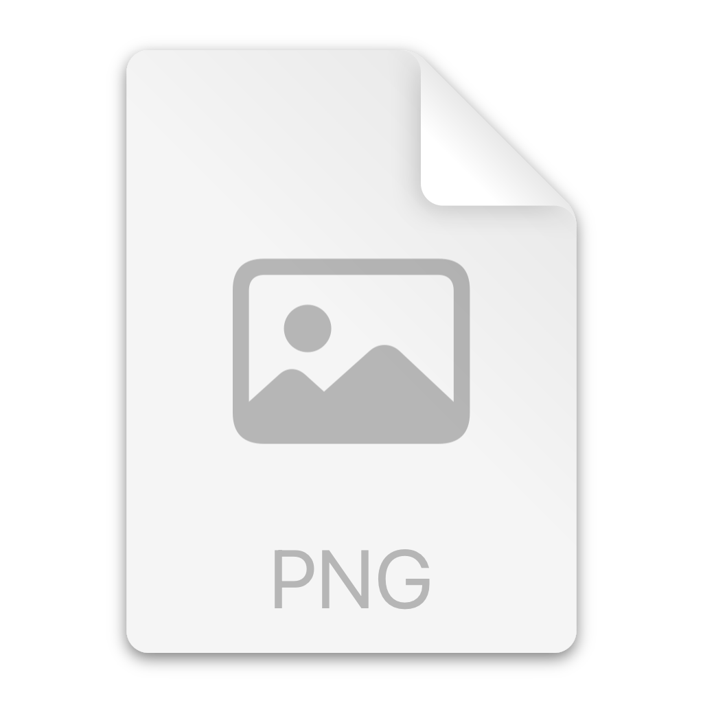

# Self-Assessment: Mikita Kern
**GitHub:** [Nck1969](https://github.com/Nck1969)  
**Pull Request:** [PR Link](https://github.com/jsgods-rs-tandem/rs-tandem/pull/208)  
**Total self score:** 180

## 📋 Personal Features Table

| **Category** | **Feature**                                                                                                                           | **Description**                                                                                                                                                                                          | **PR Link**                                                                                                                                                                                      | **Score** |
|---------|---------------------------------------------------------------------------------------------------------------------------------------|----------------------------------------------------------------------------------------------------------------------------------------------------------------------------------------------------------|--------------------------------------------------------------------------------------------------------------------------------------------------------------------------------------------------|-----------|
| My Components | Auth Pages (Sign-in/Sign Up. Auth service, Auth interceptor, Auth Initializer, Modals, Forms, Progressive Password validation, Tooltip) | Implemented authentication and registration pages with the necessary functional components for full authentication support                                                                               | [PR #87](https://github.com/jsgods-rs-tandem/rs-tandem/pull/87) [PR #139](https://github.com/jsgods-rs-tandem/rs-tandem/pull/139) [PR #206](https://github.com/jsgods-rs-tandem/rs-tandem/pull/206) | +25       |
|  | i18n via Transloco                                                                                                                    | Setted up i18n. Added translation capability and multi-language support. Type-safe translation keys for convenient development. CI validation to check translation keys                                  | [PR #188](https://github.com/jsgods-rs-tandem/rs-tandem/pull/188)                                                                                                                                | +10       |
|  | E2E Playwright tests                                                                                                                  | Setted up E2E tests. Playwright framework configuration for E2E tests. CI/CD integration for automated test execution. Tests run in Docker containers for consistency across different operating systems | [PR #182](https://github.com/jsgods-rs-tandem/rs-tandem/pull/182)                                                                                                                                | +10       |
|  | Modal                                                                                                                                 | Reusable global UI Component for displaying messages for user                                                                                                                                            | [PR #139](https://github.com/jsgods-rs-tandem/rs-tandem/pull/139)                                                                                                                                | +10       |
|  | Input                                                                                                                                 | Reusable UI input component                                                                                                                                                                              | [PR #60](https://github.com/jsgods-rs-tandem/rs-tandem/pull/60)                                                                                                                                  | +10       |
| UI & Interaction | i18n                                                                                                                                  | Auth pages/modals language switching (en/ru)                                                                                                                                                             | [PR #188](https://github.com/jsgods-rs-tandem/rs-tandem/pull/188)                                                                                                                                | +10       |
|  | Accessibility (a11y)                                                                                                                  | Aria attributes, semantic tags, keyboard navigation, labels + for                                                                                                                                        | —                                                                                                                                                                                                | +10       |
|  | Responsive Design                                                                                                                     | Full mobile optimization (down to 320px)                                                                                                                                                                 | —                                                                                                                                                                                                | +5        |
|         | Progressibe password validation                                                                                                       | Real-time password strength indicator that displays four validation requirements as the user types                                                                                                       | [PR #206](https://github.com/jsgods-rs-tandem/rs-tandem/pull/206)                                                                                                                                | +10       |
| Quality | Unit tests                                                                                                                            | (Basic): 20%+ test coverage for core personal logic.                                                                                                                                                     |                                                                                                                                    | +10       |
|         | Unit tests                                                                                                                            | (Full): 50%+ test coverage including edge cases.                                                                                                                                                         |                                                                                                                                    | +10       |
|         | E2E tests                                                                                                                             | Auth Pages full tests coverage                                                                                                                                                                           |                                                                                                                                    | +10       |
| DevOps & Role | CD                                                                                                                                    | CD to Github Pages & Railway                                                                                                                                                                             |                                                                                                                                    | +5        |
|  | CI                   | Code Quality (lint, prettier, typecheck, i18n keys check, lockfile check). Tests (unit, E2E). Build (FE, BE)                                                                                                                                                                                                         |                                                                                                                                    | +5        |
| Architecture | State Manager                                                                                                                         | Custom signals based state manager                                                                                                                                                                       |                                                                                                                                                                                                  | +10       |
|         | API Layer                                                                                                                             | Abstracted service layer to decouple UI from API logic.                                                                                                                                                  |                                                                                                                                                                                                  | +10       |
|         | Design Patterns: Component Composition + Facade Pattern                                                                               | Reusable UI elements. Container(Smart) & Presentational (Dumb) Components. DRY. AuthPageComponent is Facade to complex auth pages                                                                        |                                | +10       |
| Frameworks | 	Angular                                                                                                                              | Usage of Angular                                                                                                                                                                                         |                                                                                                                                                                                                  | +10       |
| **TOTAL** |                                                                                                                                       |                                                                                                                                                                                                          |                                                                                                                                                                                                  | **180**   |

## 🛠 Unit Tests Coverage

## 🛠 Work Description

В этом проекте я развивал навыки полнотекстовой разработки, работая с **Angular** для фронтенда.
Основной фокус был направлен на выстраивание надежной системы аутентификации, внедрение
интернационализации, настройку CI/CD пайплайна и обеспечение качества кода через тестирование и
code review.

### Ключевые этапы разработки:

**Февраль 2026 — Инфраструктура и CI/CD:**
- Реализовал полный CI/CD пайплайн на GitHub Actions с использованием GitHub Pages для деплоя фронтенда и Railway для бэкенда
- Настроил проверки качества кода: ESLint, Prettier, TypeScript проверки
- Добавил запуск тестов (unit и E2E) в CI процесс

**Февраль-Март 2026 — Frontend компоненты и аутентификация:**
- Разработал переиспользуемый **Input компонент** с поддержкой различных типов полей, валидацией и обработкой ошибок
- Реализовал **страницы регистрации и входа** с использованием Facade Pattern для минимизации дублирования кода
- Создал **модальные окна** для отображения ошибок авторизации и системных сообщений
- Внедрил **обработку ошибок** с маппингом сообщений сервера на user-friendly формат
- Интегрировал **loading states** для кнопок отправки форм
- Добавил **автоматическое закрытие модалок** при навигации и обработку истечения токена авторизации

**Март 2026 — Интернационализация и продвинутые фичи:**
- Настроил **i18n систему** с использованием Transloco для динамической смены переводов без перезагрузки страницы
- Типизировал **ключи переводов** (автокомплит в IDE, проверка ключей)
- Добавил **проверку неиспользуемых ключей** в CI пайплайн
- Реализовал **Progressive Password Validation** — визуальная индикация требований к паролю в реальном времени 
- (минимальная длина, заглавные буквы, цифры, спецсимволы)

**Март 2026 — E2E тестирование:**
- Настроил **Playwright** для E2E тестирования с запуском в Docker для кросс-платформной консистентности
- Реализовал **globalSetup** для очистки БД перед каждым запуском тестов
- Добавил проверку актуальности package.lock в CI

**Архитектурные решения:**
- Использовал **Facade Pattern** для AuthPageComponent, что позволило полностью исключить дублирование между страницами Sign-In и Sign-Up
- Разделил компоненты на **Smart (контейнеры)** и **Dumb (presentational)** для лучшей переиспользуемости
- Реализовала **Auth Store** на базе Angular Signals (вместо NgRx) для упрощения и единообразия с остальным проектом
- Создал **абстрактный сервисный слой** для отделения UI логики от API запросов

**Контроль качества:**
- Писал unit тесты для компонентов и сервисов (покрытие >50%)
- Проводил **code review** для других разработчиков
- Использовал интерактивные гайды Angular и консультировался с AI ассистентом как ментором для ускорения обучения

**Процесс разработки:**
- Систематически вел дневники разработки для отслеживания прогресса
- Активно взаимодействовал с командой на встречах и через code review

## Feature Components

### 1. Authentication Pages (Sign-In / Sign-Up)

**Описание:**
Реализована полная система аутентификации с двумя отдельными страницами (вход и регистрация), которые используют единый layout компонент (Facade Pattern) для минимизации дублирования кода.

**Компоненты:**
- **AuthPageComponent** — переиспользуемая обертка для обеих страниц (заголовок, форма, переключение между Sign-In/Sign-Up)
- **SignInComponent** — форма входа с валидацией email и пароля
- **SignUpComponent** — форма регистрации с username, email, пароля и Progressive Password Validation
- **InputComponent** — переиспользуемый input с поддержкой различных типов, ошибок, hints
- **ModalComponent** — модальные окна для отображения ошибок и успешных сообщений

**Функциональность:**
- Валидация форм на клиенте (required, email, minLength, pattern)
- Loading states на кнопках отправки
- Обработка HTTP ошибок с маппингом на user-friendly сообщения
- Модальные окна для отображения ошибок авторизации и истечения токена
- Поддержка русского и английского языков (i18n)
- Полная доступность (a11y): семантический HTML, ARIA labels, keyboard navigation

**Архитектурные решения:**
- **Facade Pattern** (AuthPageComponent) — скрывает сложность layout'а, позволяет подставлять разные формы
- **Container/Presentational Components** — SignInComponent (smart, управление состоянием) и AuthPageComponent (dumb, только отображение)
- **Reactive Forms** — использование FormGroup/FormControl для управления состоянием форм
- **RxJS** — switchMap для объединения login + getMe запросов

---

### 2. Internationalization (i18n) с Transloco

**Описание:**
Полная система многоязычной поддержки проекта на базе библиотеки Transloco. Система позволяет динамически менять язык без перезагрузки страницы и обеспечивает type-safe доступ к ключам переводов.

**Реализованное:**

**Настройка Transloco:**
- Инициализация Transloco с русским и английским языками
- Динамическая загрузка файлов переводов (не требует предзагрузки всех языков)
- Синхронизация языка с localStorage для сохранения выбора пользователя
- Возможность переключения языка из Header компонента

**Type-safe Translation Keys:**
- Использование **transloco-keys-manager** для автоматического сбора всех используемых ключей
- Генерация типов (AppTranslationKey) для автокомплита в IDE
- Кастомный **TypedTranslocoPipe** для type-safe использования переводов в шаблонах
- Функция **marker()** для обозначения строк, требующих перевода

**CI/CD интеграция:**
- Проверка в CI, что используются только существующие ключи переводов
- Проверка, что все используемые ключи имеют переводы на оба языка
- Предотвращение ошибок на продакшене из-за отсутствующих переводов

**Архитектурные решения:**
- **Transloco** - динамическое обновление текста без перезагрузки страницы
- **Типизация ключей** — исключает класс ошибок "забыл ключ" или "опечатался в ключе"
- **Utility функции** — injectTranslate(), getValidationErrorKey() для упрощения доступа к переводам
- **Фасадный подход** — все переводы хранятся в единой структуре, легко масштабировать

**Поддерживаемые языки:**
- 🇷🇺 Русский (ru)
- 🇬🇧 Английский (en)
