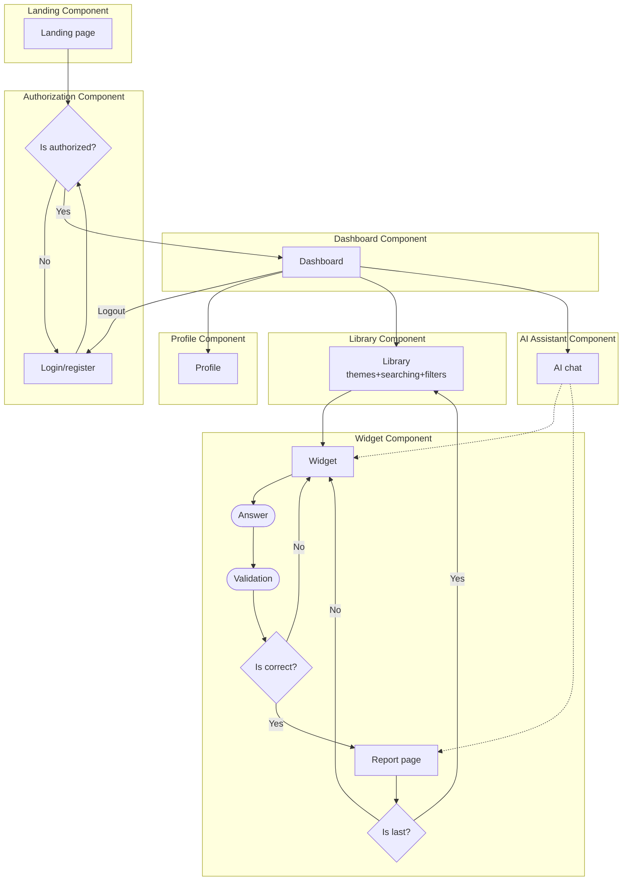

```mermaid
graph TD
    subgraph LandingGroup [Landing Component]
    Landing[Landing page]
    end

    subgraph DashboardGroup [Dashboard Component]
    Dashboard[Dashboard]
    end

    subgraph AuthGroup [Authorization Component]
        Auth{Is authorized?}
        Login[Login/register]
    end

    subgraph ProfileGroup [Profile Component]
        Profile[Profile]
    end

    subgraph AIChatGroup [AI Assistant Component]
        AIChat[AI chat]
    end

    subgraph LibraryGroup [Library Component]
        Library[Library<br/>themes+searching+filters]
    end

    subgraph WidgetModule [Widget Component]
        Widget[Widget]
        WidgetAnswer([Answer])
        WidgetValidation([Validation])
        WidgetCorrect{Is correct?}
        WidgetReport[Report page]
        WidgetIsLast{Is last?}
    end

    %% General connections
    Landing --> Auth
    Auth -- No --> Login
    Auth -- Yes --> Dashboard
    Login --> Auth

    Dashboard -- Logout --> Login
    Dashboard --> Profile
    Dashboard --> Library
    Dashboard --> AIChat

    Library --> Widget


    %% Connections between components

    AIChat -.-> Widget
    AIChat -.-> WidgetReport


    %% Widget
    Widget --> WidgetAnswer
    WidgetAnswer --> WidgetValidation
    WidgetValidation --> WidgetCorrect
    WidgetCorrect -- No --> Widget
    WidgetCorrect -- Yes --> WidgetReport
    WidgetReport --> WidgetIsLast
    WidgetIsLast -- Yes --> Library
    WidgetIsLast -- No --> Widget
```
